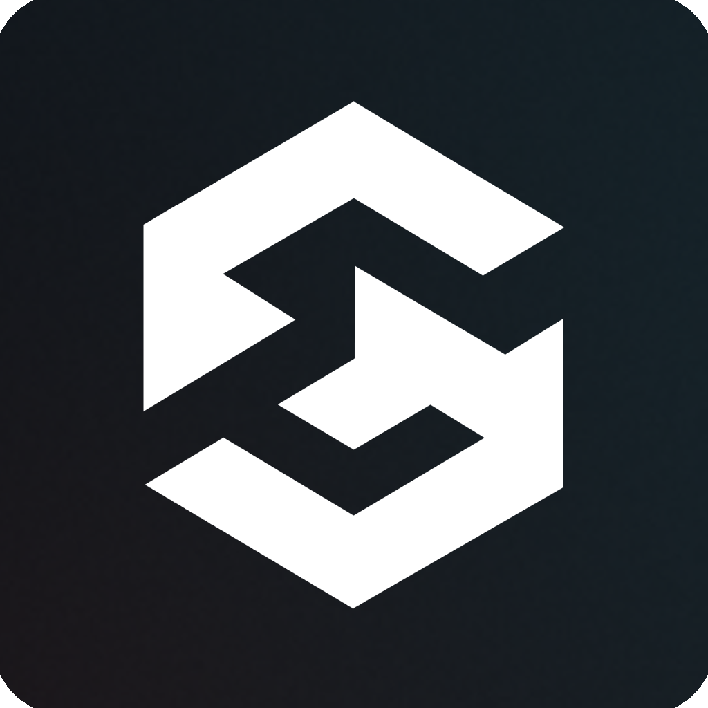

<h1>
  
  &nbsp;&nbsp;SIGMA-UI
</h1>

**SIGMA-UI** - is a collection of fully customizable well-built components and blocks for Vue.

It takes away the burden of recreating the same components from scratch for every new project, giving you components that you can quickly add and modify to your design system.


## About

**Website**: https://sigma-ui.dev
<br/>**NPM**: https://www.npmjs.com/package/sigma-ui

## Community links
[Discord](https://discord.gg/jH2X4VGBA4) | [YouTube](https://www.youtube.com/@sigma-dev) | [X (Twitter)](https://twitter.com/sigma__dev) | [Telegram](https://t.me/sigma_devs)
<br>Thanks to everyone who has been sharing this project with others!

## Features

- **Supported frameworks**: Vue, Nuxt, Laravel, Astro.
- **Supported languages**: TS (all components are typed, JS projects are not supported).
- **Supported vue versions**: 3 and above.
- **Supported style systems**: CSS, Tailwind 4.
- **Is open-source**: Yes, MIT licensed.
- **Accessibility**: Supported.
- **Based upon**: Radix Vue primitives.
- **Installation method**: The components are distributed via the method I call GOAT (Git Obtained As Template) - run `npx` commands to clone the components from git registry directly to your project components directory. Unlike NPM modules, these components are copied from git registry directly into your project and give you full control over customization, instead of using just props and css overrides.

## Usage

Step 1: Initialize SIGMA-UI config in your project:

```
npx sigma-ui init
```

Step 2: Add components to your project:

```
npx sigma-ui add
```

Step 3: Use the added components, modify their code to your needs.


## Comparison

You are a developer, you create another new project (personal or work), it needs 20+ components, and they all need to follow your own / company's design system, and be accessible, and have all the basics done right - what are your choices?

- **What sad devs do:** spend a year creating every component from scratch for every new project they work on, end up with a broken buggy mess of components without any basic keyboard navigation support, modals that you cannot close with Esc, and no accessibility at all.
- **What Beta devs do:** use a conventional library (e.g Vuetify, Quasar) and monkey patch components' css with `!important`, trying to make their components follow their design system, and failing to modify baked-in Material design and animations.
- **What Sigma devs do:** add these GOAT components directly to your main (or uikit) project "components" dir, spend a little time modifying their design and functionality as needed. Profit.

#### Customization
- **Sigma UI**: 100% customizable, all functionality is replaceable
- **Custom Components**: 100% customizable, all functionality is replaceable
- **Conventional UI Libs**: Black boxes, limited to customization via props, slots, and CSS monkey-patch overrides

#### Development Time
- **Sigma UI**: Minimal - just add and modify well-built components to your needs
- **Custom Components**: Extensive - build everything from scratch
- **Conventional UI Libs**: Unexceptable - no matter how much time you spend, you will never modify all components to the level you need, without using ugly overrides.

#### Code Control
- **Sigma UI**: Full control - components are in your project
- **Custom Components**: Full control - components are in your project
- **Conventional UI Libs**: Limited - black box components

#### Design System Integration
- **Sigma UI**: Easy - modify primitive components to spec
- **Custom Components**: Easy - build exactly to spec
- **Conventional UI Libs**: Difficult - requires CSS overrides

#### Maintenance
- **Sigma UI**: Your responsibility
- **Custom Components**: Your responsibility
- **Conventional UI Libs**: Handled by library maintainers

#### Accessibility
- **Sigma UI**: Built-in (based on Radix primitives)
- **Custom Components**: Your responsibility, and be honest, you know almost nothing about accessibility
- **Conventional UI Libs**: Usually included

## Supporters

Consider supporting the project:

- [Patreon](https://patreon.com/sigma_ui) - monthly, with rewards
- [Donation Alerts](https://donationalerts.com/r/sigma_dev) - one-time donations

### Current supporters

<table>
  <tbody>
    <tr>
      <td align="center" valign="middle">
        <a href="https://cyberpunk-card.vercel.app" title="Masih Abjadi">
          
          Masih Abjadi
        </a>
        <br/>Fullstack dev • Looking for job
      </td>
    </tr>
  </tbody>
</table>

## Credits

Created, designed, and maintained by [Aleksey Hoffman](https://github.com/aleksey-hoffman).

Special thanks to all the open-source projects and developers who have inspired and contributed to the foundation that led to the creation of this project: 
 
- [Shadcn](https://github.com/shadcn): open-source developer that showcased the first implmentation of the GOAT distribution method and beautiful components for it. 
- [Zernonia](https://github.com/zernonia): open-source developer that created Reka-ui primitives which are used as the basis for this project.

## License

Licensed under the [MIT license](https://github.com/sigma-hub/sigma-ui/blob/main/LICENSE).
