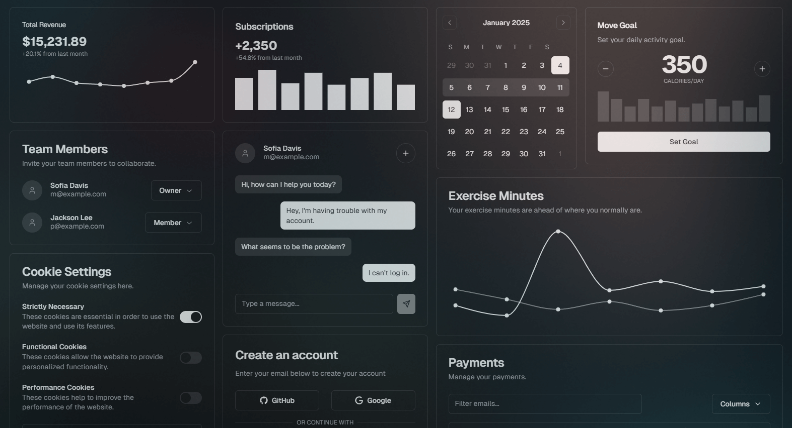

<h1>
  
  &nbsp;&nbsp;SIGMA-UI
</h1>

**SIGMA-UI** - is a collection of fully customizable well-built components and blocks for Vue, using recently invented distribution method via `npx` that I call GOAT (Git Obtained As Template).

It takes away the burden of recreating the same components from scratch for every new project, giving you components that you can quickly add and modify to your design system.

## About

**Website**: https://sigma-ui.dev
 **NPM**: https://www.npmjs.com/package/sigma-ui

- **Supported frameworks**: Vue, Nuxt, Laravel, Astro.
- **Supported languages**: TS (all components are typed, JS is not supported, move on).
- **Supported vue versions**: 3 and above.
- **Supported style systems**: CSS, Tailwind 4.
- **Is open-source**: Yes, MIT licensed.
- **Accessibility**: Supported.
- **Based upon**: Radix Vue primitives.
- **Installation method**: GOAT (Git Obtained As Template) via npx commands. Unlike NPM modules, these components are copied from git repository directly into your project's components directory and give you full control over customization, instead of using just props and css overrides.
- **Main problem it solves**: You are a developer, you create a new project, it needs 20+ components like dialogs, selects, skeletons, etc, and they all need to follow your companies' / your own design system.
  - **Beta devs** - spend half a year creating every component from scratch for every new project they work in and end up with a broken buggy mess, or use Vuetify / Quasar like library and monkey patch components' css with `!important`, trying to make them look like components in their design system.
  - **Sigma devs** - have GOAT in their stack, use well designed customizable components, easily modify design and functionality to their needs. Profit.

## Community links
[Discord](https://discord.gg/jH2X4VGBA4) | [YouTube](https://www.youtube.com/@sigma-dev) | [X (Twitter)](https://twitter.com/sigma__dev) | [Telegram](https://t.me/sigma_devs)
 Thanks to everyone who has been sharing this project with others!

## Credits

Created, designed, and maintained by [Aleksey Hoffman](https://github.com/aleksey-hoffman).

Special thanks to all the open-source projects and developers who have inspired and contributed to the foundation that led to the creation of this project: 
 
- [Shadcn](https://github.com/shadcn): open-source developer that showcased the first implmentation of the GOAT distribution method and beautiful components for it. 
- [Zernonia](https://github.com/zernonia): open-source developer that created Reka-ui primitives which are used as the basis for this project.

## License

Licensed under the [MIT license](https://github.com/sigma-hub/sigma-ui/blob/main/LICENSE).
