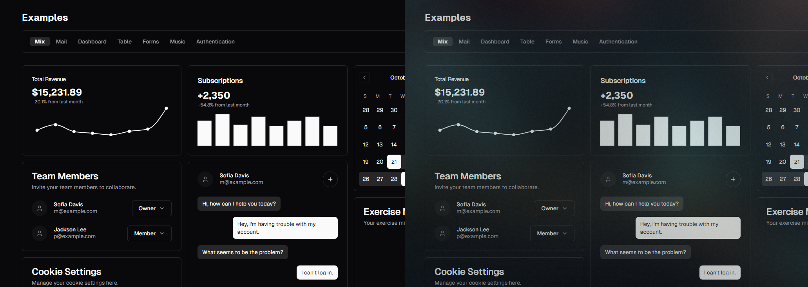
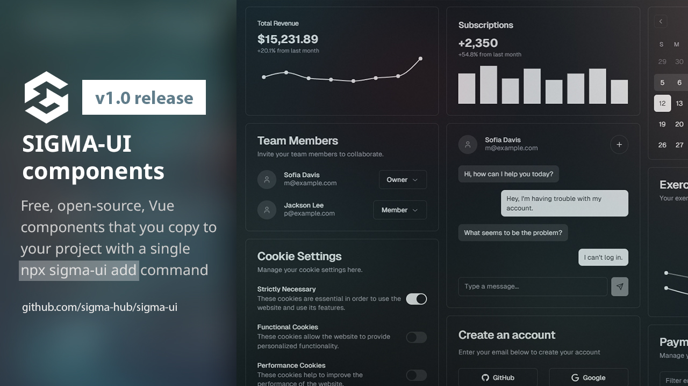

## October 2025

#### Changes

`v1.1.2`: 
- CLI: removed corepack and nypm

`v1.1.1`: 

- New: added [Infusion](https://sigma-ui.dev/components/infusion.html) component;

`v1.0.19`: 
- Updated themes: fix incorrect colors;

`v1.0.18`: 
- Updated themes: 
  - frosted-glass (new);
  - grayscale (former zinc);
  - gray (removed);
  - violet (removed);
- Improved style config: 
  - Removed repeating :root selector from css configs to avoid linter errors (duplicating selectors);
- Fixed content display issues with contextMenu, dropdown, sheet:
  - CSS, Tailwind: Fixed submenu content being cut-off;
  - CSS: Fixed problem with contextMenu and sheet not dismissing;

## September 2025

#### Changes

`v1.0.16`: 
- Removed redundant "accent" color (now components use existing "secondary" color);

## June 2025

### Project version 1.0 released 🎉

Sigma-UI was published online and open-sourced on [Github](https://github.com/sigma-hub/sigma-ui)
