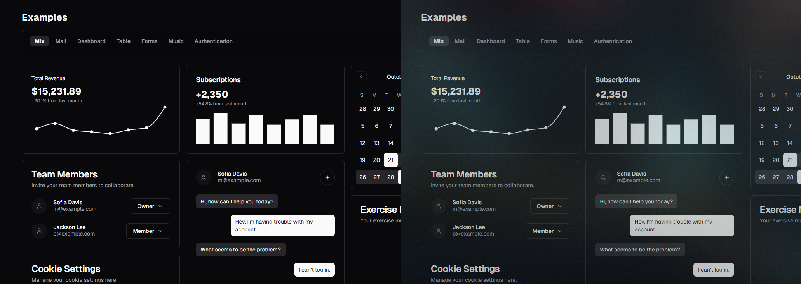
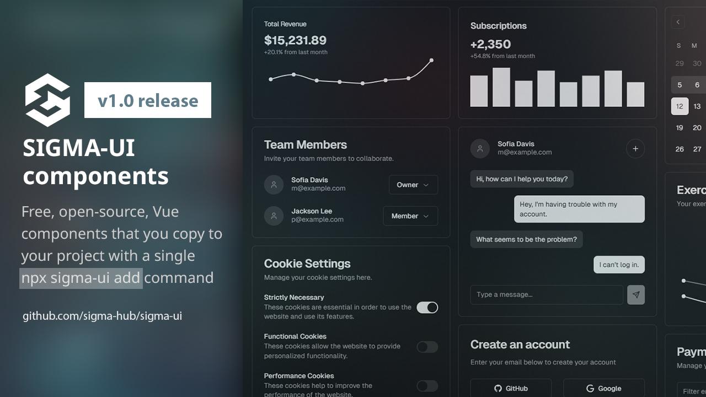

## January 2026

#### Changes

`v1.4.0`:
- New: added [ConfirmButton](/components/button#confirm) component - a button variant that shows a checkmark icon temporarily after clicking to confirm an action was completed;
- UI: updated UI element focus outlines

`v1.3.0`:
- New: added [Faceted Filter](/components/faceted-filter) component - a filter component with multi-select options, search functionality, and optional item creation;

`v1.2.0`:
- CLI: Added component naming convention option - choose between PascalCase (`ui/Button/Button.vue`) or kebab-case (`ui/button/button.vue`) for generated component directories and files;
- CLI: Simplified init script - auto-detects framework, tsconfig, and CSS paths. Only 3 essential prompts: style system, theme color, and naming convention;
- CLI: Added `-d, --defaults` flag for zero-prompt initialization with sensible defaults;
- CLI: Tailwind v4 support - new projects now use CSS-based configuration with `@theme` directive instead of JavaScript config files. Existing projects with `tailwind.config.js` continue to work via `@config` directive;

## October 2025

#### Changes

`v1.1.3`: 
- Dev: fix pnpm-lock build error

`v1.1.2`: 
- CLI: removed corepack and nypm

`v1.1.1`: 

- New: added [Infusion](https://sigma-ui.dev/components/infusion.html) component;

`v1.0.19`: 
- Updated themes: fix incorrect colors;

`v1.0.18`: 
- Updated themes: 
  - frosted-glass (new);
  - grayscale (former zinc);
  - gray (removed);
  - violet (removed);
- Improved style config: 
  - Removed repeating :root selector from css configs to avoid linter errors (duplicating selectors);
- Fixed content display issues with contextMenu, dropdown, sheet:
  - CSS, Tailwind: Fixed submenu content being cut-off;
  - CSS: Fixed problem with contextMenu and sheet not dismissing;

## September 2025

#### Changes

`v1.0.16`: 
- Removed redundant "accent" color (now components use existing "secondary" color);

## June 2025

### Project version 1.0 released 🎉

Sigma-UI was published online and open-sourced on [Github](https://github.com/sigma-hub/sigma-ui)
