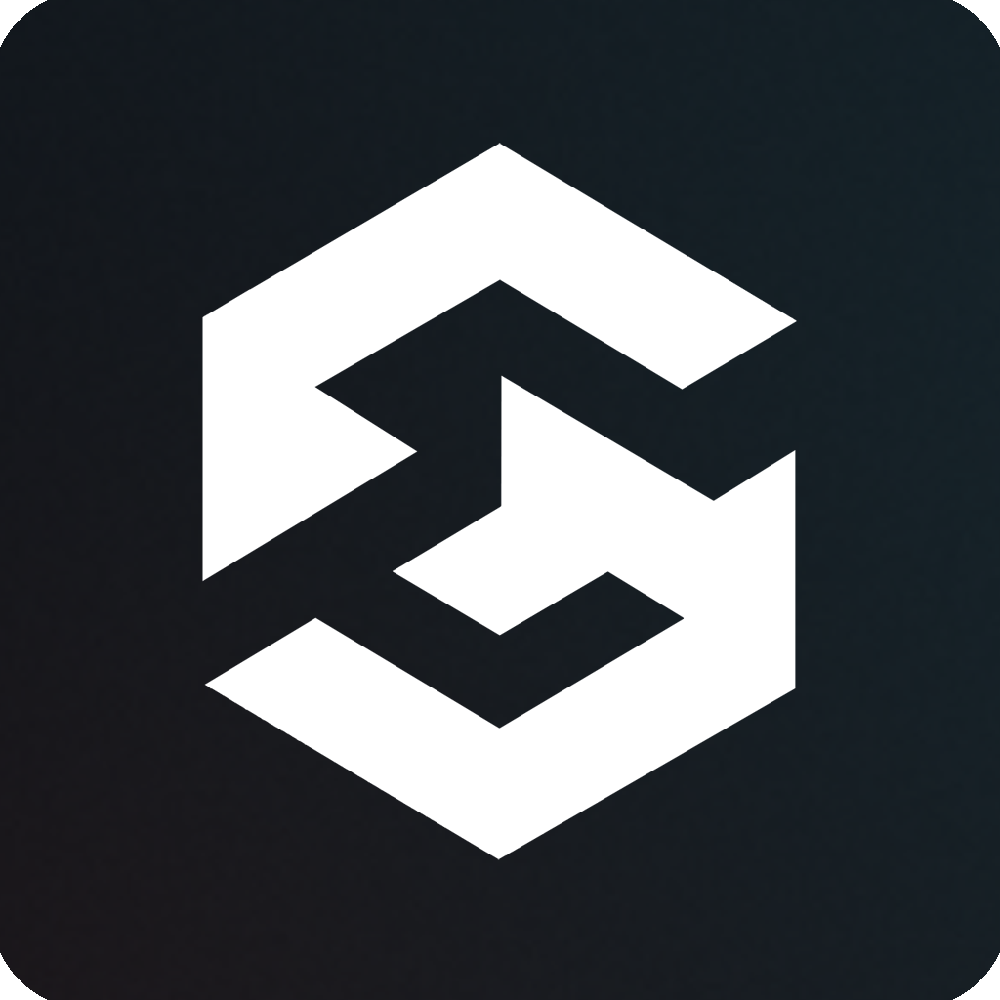
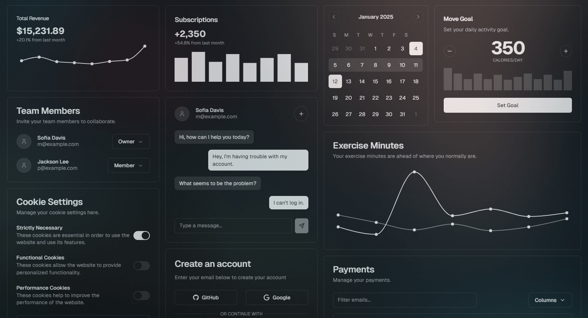

<h1>
  
  &nbsp;&nbsp;SIGMA-UI
</h1>

**SIGMA-UI** - is a collection of fully customizable well-built components and blocks for Vue, using recently invented distribution method via `npx` that I call GOAT (Git Obtained As Template).

It takes away the burden of recreating the same components from scratch for every new project, giving you components that you can quickly add and modify to your design system.




## About

**Website**: https://sigma-ui.dev
<br/>**NPM**: https://www.npmjs.com/package/sigma-ui

## Community links
[Discord](https://discord.gg/jH2X4VGBA4) | [YouTube](https://www.youtube.com/@sigma-dev) | [X (Twitter)](https://twitter.com/sigma__dev) | [Telegram](https://t.me/sigma_devs)
<br>Thanks to everyone who has been sharing this project with others!

## Features

- **Supported frameworks**: Vue, Nuxt, Laravel, Astro.
- **Supported languages**: TS (all components are typed, JS projects are not supported).
- **Supported vue versions**: 3 and above.
- **Supported style systems**: CSS, Tailwind 4.
- **Is open-source**: Yes, MIT licensed.
- **Accessibility**: Supported.
- **Based upon**: Reka (formerly Radix-Vue) primitives.
- **Installation method**: The components are distributed via the method I call GOAT (Git Obtained As Template) - run `npx` commands to clone the components from git registry directly to your project components directory. Unlike NPM modules, these components are copied from git registry directly into your project and give you full control over customization, instead of using just props and css overrides.

## Usage

Step 1: Initialize SIGMA-UI config in your project:

```
npx sigma-ui init
```

Step 2: Add components to your project:

```
npx sigma-ui add
```

Step 3: Use the added components, modify their code to your needs.


## Credits

Created, designed, and maintained by [Aleksey Hoffman](https://github.com/aleksey-hoffman).

Special thanks to all the open-source projects and developers who have inspired and contributed to the foundation that led to the creation of this project: 
 
- [Shadcn](https://github.com/shadcn): open-source developer that showcased the first implmentation of the GOAT distribution method and beautiful components for it. 
- [Zernonia](https://github.com/zernonia): open-source developer that created Reka-ui primitives which are used as the basis for this project.

## License

Licensed under the [MIT license](https://github.com/sigma-hub/sigma-ui/blob/main/LICENSE).
